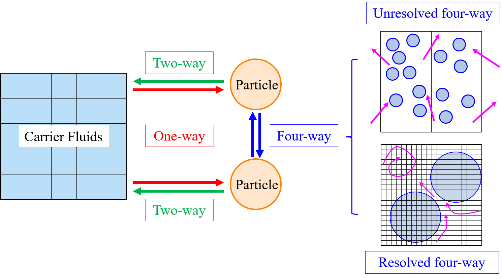
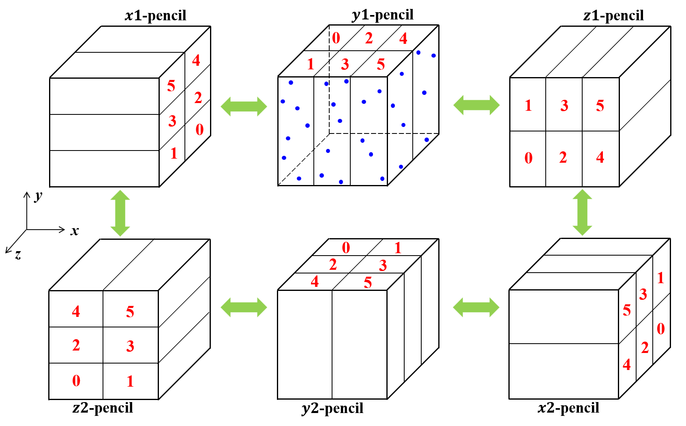
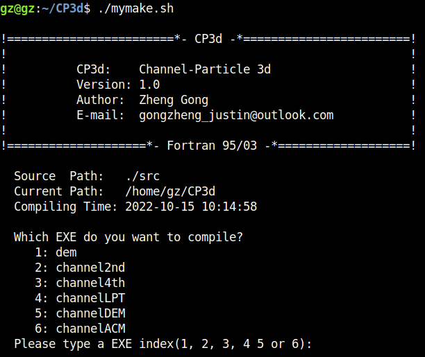

# CP3d
&emsp;**CP3d** (Channel-Particle 3d) is a comprehensive Euler-Lagrange solver for the direct numerical simulations of particle-laden flows.

* Have the ability to perform **one-way**, **two-way**, **interface-unresolved four-way**, and **interface-resovled four-way** coupling regime.
* For the fluid sub-solver, both the second-order and four-order finite difference discretization are available, in company with three viscous term treatment approaches: i.e., fully-implicit, partial-implicit, and fully-explicit.
* For the **discrete-element-method (DEM)** solver, both linear and non-linear contact force models can be used, and the collision time can be also adaptive.
* The **immersed boundary method (IBM)** is used in interface-resolved simulation, and totally three IBM coupling approaches are included.
* In order to improve the numerical accuracy of the computational **Basset history force**, a third-order exponential approximation method is proposed in interface-unresolved four-way regime.
* An **averaged lubrication force model** is proposed for the short-range hydrodynamic interaction.
* The volume integration approach is also modified to adapt the staggered mesh configuration.
* The resulting solver is able to simulate large scale cases of **billions of grid points** with **millions of moving particles** in interface-resolved four-way regime using only hundreds of computational cores.
* MPI parallelization by means of pencil distributed decomposition. In order to improve the parallel efficiency, we propose a new 2D pencil-like parallel configuration with totally 6 different pencil arrangements.  
          

## Overview of the solvers :book:
&emsp;There are totally 6 solvers in **CP3d**: 
| Solver | Note |
| :--: | :-- |
| [dem](https://github.com/GongZheng-Justin/sDEM) | The pure DEM solver | 
| [channel2nd](https://github.com/GongZheng-Justin/Channel3d) | The pure 2nd order DNS solver | 
| [channel4th](https://github.com/GongZheng-Justin/ParaTC) | The pure 4th order DNS solver | 
| channelLPT | One- and two-way DNS-LPT coupling solver | 
| channelDEM | Interface-unresolved DNS-DEM coupling solver | 
| channelACM | DNS-DEM-IBM coupling solver | 



## Installation :briefcase:
&emsp;During developing this solver, I often try my best to make it easy-to-understand and easy-to-use. As for compilation, present solver only has the following two prerequisites:

* MPI
* Gfortran/Intel Fortran (Supporting Fortran 2003 or higher version)

&emsp;**FFTW-3.3.9** library has been explicitly included in the directory `./src/ThirdParty/fftw/`, but it is strongly recommended to recomplied FFTW-3.3.9 for the first use. After entering the folder `CP3d-master/` in terminal, you can compile the code as follows:
```
1. chmod a+x ./mymake.sh
2. ./mymake.sh
3. choose the correct compiler you use, and the executable you want to compile, following guidances printed in the terminal
```

## Usage :blue_book:
&emsp;After compiling the code successfully, you can run the executable file like that:
```
mpirun -n [np] [exeName] [inputFile1] [inputFile2]
```
&emsp;Here:
* `np` denotes the number of processors you use
* `exeName` stands for specific executable file name, namely `channel2nd` or `channel4th`
* `inputFile1` is the name string for the 1st input parameter file  
* `inputFile2` is the name string for the 2nd input parameter file, if any

&emsp;For instance, if you want to run the lid-driven cavity case, you can type the following words in your terminal:
```
mpirun -n 4 ./channel2nd ./Input/CFD_2nd/LidDrivenCavity.prm
```
The following table provides examples to run CP3d after compilation:
| Solver | Tying in terminal |
| :--: | :-- |
| dem | mpirun -n 8 ./dem ./Input/DEM/DEM_Settling.standard | 
| channel2nd | mpirun -n 8 ./channel2nd ./Input/CFD_2nd/TurbCha0180_2nd.standard | 
| channel4th | mpirun -n 8 ./channel4th ./Input/CFD_4th/TurbCha0180_4th.standard | 
| channelLPT | mpirun -n 8 ./channelLPT ./Input/CFDLPT_OneWay/Channel4th_LPT.oneway ./Input/CFDLPT_OneWay/LPT_Channel4th.oneway | 
| channelDEM | mpirun -n 8 ./channelDEM ./Input/CFDDEM/ParticleFalling/ChannelDEM_falling.case01 ./Input/CFDDEM/ParticleFalling/DEMChannel_falling.case01 | 
| channelACM | mpirun -n 8 ./channelACM ./Input/ParticleFalling/SphereCate.cfd1 ./Input/ParticleFalling/SphereCate.acm | 

### Input file
&emsp;The input file examples are stored in the folder `./Input/`.

## Benchmarks :speedboat:


## Acknowledgements :clap:
&emsp;Since Sep 2019, when I finally decided to develop my own CFD-DEM code from scratch, I have learnt quite a lot from the following really kind researchers (**in alphabetical sequence**):

* [Dr. Costa](https://p-costa.github.io/) from University of Iceland, and his second-order DNS code [CaNS](https://github.com/p-costa/CaNS), also his papers on IBM approach.
* [Dr. He](https://www.engineering.iastate.edu/people/profile/phe/) from Iowa State University, and his fourth-order DNS solver [HercuLES](https://github.com/friedenhe/hercules).
* [Prof. Ji](http://faculty.tju.edu.cn/ChunningJi/en/index.htm) from Tianjin University, on the fruitful discussion about the particle IBM method, and on the access to their in-house DNS/LES-Solid interaction code **_cgLES_**.
* [Dr. Laizet](http://www.imperial.ac.uk/people/s.laizet) from Imperial College London, and their compact FD code [Incompact3d](https://github.com/xcompact3d/Incompact3d).
* [Prof. Marchioli](http://158.110.32.35/) from University of Udine, on the fruitful and continuous discussion about one-way CFD-Particle coupling benchmark and on the access to their [benckmark data](http://158.110.32.35/download/DNS-TEST-CASE/).
* [Prof. Meiburg](https://me.ucsb.edu/people/eckart-meiburg) from University of California, Santa Barbara.
* [Dr. Norouzi](https://www.researchgate.net/profile/Hamid-Norourzi) from University of Tehran, and his book **_Coupled CFD‐DEM Modeling: Formulation, Implementation and Applimation to Multiphase Flows_**, besides the [attached DEM code](https://www.wiley.com//legacy/wileychi/norouzi/form.html?type=SupplementaryMaterial).
* [Prof. Orlandi](http://dma.ing.uniroma1.it/users/orlandi/resume.html) from Sapienza University of Rome, and his book **_Fluid flow phenomena: a numerical toolkit_**, besides the [attached CFD code](http://dma.ing.uniroma1.it/users/orlandi/diskette.tar.gz).
* [Dr. Tschisgale](https://www.researchgate.net/profile/Silvio-Tschisgale) from Institute of Air Handling and Refrigeration, on the fruitful and continuous discussion about their IBM approach.
* [Prof. Zhao](http://www.hy.tsinghua.edu.cn/info/1154/1829.htm) from Tsinghua university, on the one-way CFD-Particle coupling benchmark.
* ......

&emsp;Without those researchers' help, I might do nothing but sleep in the dormitory all the days!!!:joy::joy::joy:   
&emsp;Thanks so much again and again !!!

## Contact and Feedback :email:
&emsp;If you have any question, or want to contribute to the code, please don't hesitate to contact me: Zheng Gong (gongzheng_justin@outlook.com)
